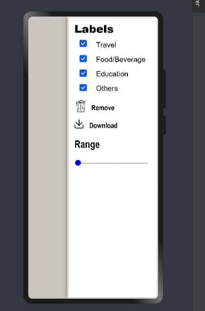

# Material Side Sheet

Side Sheet can be used to stack on the 
top of current UI, which allows the user 
to create the custom UI.

# Installation

```c
npm i @ohos/side-sheet
```

# Instructions 
```c
//Creating object 
@State sheetSide : sideSheetModel  = new sideSheetModel()
// Declaring the visible boolean variable
@State sheetVisible: boolean = false
```
The Custom UI can be create Using the @Builder Function
```c
// Create a builder function for UI
@Builder sheetDesign(): any {
    //UI
    Column() {
      Text("Add UI here")
        .fontSize(30)_
   }
 }
 
```
Passing the values to Material Sheet . Check the sample code.
```c
 build() {
    Stack() {
        Column() {

            Button('Show Sheet')
            .onClick(() => this.sheetVisible = true)

        }
        .width('100%')
        .height('100%')
`       //Passing the values
        MaterialSheet({
        model : $sheetSide,
        body : this.sheetDesign,
        visible: $sheetVisible
        })
    }.height("100%")
    .width("100%")
}
```

.png)



Note : The properties of the sheet like positioning, 
color, border width and color, shadow radius, etc are also customizable based on the requirement.
# Compatibility 

Supports OpenHarmony API version 9

# Code Contribution

If you find any problems during usage, you can submit
an [Issue](https://github.com/Applib-OpenHarmony/SideSheet/issues) to us. Of course, we also welcome you to
send us [PR](https://github.com/Applib-OpenHarmony/SideSheet/pulls).

# Open Source License

This project is based
on [Apache License 2.0](https://github.com/Applib-OpenHarmony/SideSheet/blob/main/LICENSE), please enjoy and
participate in open source freely.
# Reference

Designed by : Chaitanya P